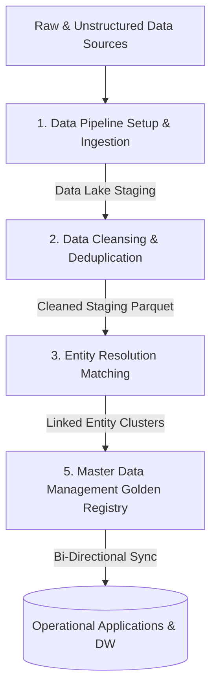

# KMH Entity Resolution & Master Data Management Framework
*Enterprise Reference Architecture & Implementation Guide*

## 1. Executive Summary
This document outlines the reference **Entity Resolution (ER)** and **Master Data Management (MDM)** implementation framework deployed by **KMH Data Management and Consultants**. 

Having built a reputation for delivering bespoke data architecture and consulting services for major financial firms across Canada, the United States, and Europe, KMH has recently packaged these production-tested patterns into a dedicated, high-performance Entity Resolution product suite.

Our solution automates the ingestion of raw, unstructured files, cleanses inconsistencies, and resolves fragmented entities across internal and third-party registries (such as Dun & Bradstreet (D&B) and Standard & Poor’s (S&P)). This framework provides a critical foundation for **Know Your Customer (KYC)** registries, **Master Data Management (MDM)** systems, **Anti-Money Laundering (AML)** monitoring, and **Fraud Detection** architectures—building enriched, high-context **Golden Records** suitable for strict enterprise compliance and operational workflows.

---

## 2. System Architecture & Reference Pipeline
KMH utilizes a modular, decoupled architecture optimized for streaming pipelines (e.g., Apache Spark (batch & streaming), Apache Flink, Apache Kafka) and storage layers (e.g., Delta Lake).



### Reference Implementation Stages

#### 1. Data Pipeline Setup & Data Ingestion
- **Objective**: Establish high-throughput pipelines to ingest raw, unstructured, or semi-structured data (JSONs, CSVs, log files) from transactional databases, third-party APIs, and CRMs.
- **Technology**: Deploy pipelines using Apache Spark, Kafka, or AWS Glue, targeting a centralized enterprise **Data Lake** (e.g., Delta Lake, Apache Iceberg, or Snowflake S3 stage).

#### 2. Data Cleansing & Deduplication
- **Objective**: Standardize record attributes to a common format and eliminate raw duplicates early in the pipeline.
- **Process**: Perform schema-conformance checks, standardizations, format validations, and initial exact-match deduplication. Resolve complex global addresses using bespoke and custom parsers (incorporating NLP-based address parsing) to ensure highly precise downstream matching.

#### 3. Entity Resolution
- **Objective**: Identify separate records that belong to the same real-world individual or business entity across separate systems.
- **Process**: Formulate candidate "blocking keys" to group records, then calculate similarity scores using Jaro-Winkler and Levenshtein metrics. Graph-based clustering is used to establish transitive linkage.

#### 5. Master Data Management (MDM)
- **Objective**: Compile and maintain the single source of truth (Golden Records) and distribute these identifiers.
- **Process**: Apply survivorship rules (recency, source authority, completeness) to resolve conflicting records, storing golden entities in a central MDM hub and synchronizing resolved keys back to downstream operational systems.

---

## 3. Cleansing & Standardization Rules
High-accuracy Entity Resolution relies on strict data normalization. KMH implements the following standard rules:

| Attribute | Normalization Technique | Example Input | Normalized Output |
| :--- | :--- | :--- | :--- |
| **Phone Number** | Strip non-numeric characters, preserve country code `+` | `(555) 019-2834 ext. 12` | `+15550192834` |
| **Email Address** | Trim, convert to lowercase, validate syntax | ` John.Doe@Domain.com ` | `john.doe@domain.com` |
| **State Code** | Map full names to ISO/Standard postal abbreviations | `New York` | `NY` |
| **ZIP Code** | Strip non-numeric and non-hyphen symbols | `10001-2345 (NY)` | `10001-2345` |
| **Date of Birth** | Standardize to ISO `YYYY-MM-DD` | `1990/05/14` | `1990-05-14` |

---

## 4. Key-Based Resolution (Blocking)
To resolve individuals and businesses, KMH constructs composite keys from the cleansed attributes. If multiple records share the same composite resolution key, they are merged into the same entity identifier.

### Individual Resolution Keys
Individual records are grouped based on the following composite key (in order of priority):
```
license_id + first_name + middle_name + date_of_birth + street
```
*Rationale: License ID provides strong unique identification, while name and address details resolve records across systems where identifier formatting differs.*

### Business Resolution Keys
Business records are grouped using:
```
company_name + street
```
*Rationale: Minimizes duplication of corporate entities operating out of the same location under minor name variations.*

---

## 5. Survivorship & Golden Record Creation
Once a group of duplicate records is clustered under a single resolved Entity ID, the system compiles the **Golden Record** using **Survivorship Rules**:

- **Most Complete Value**: If Record A has a middle name but Record B does not, the golden record inherits the middle name from Record A.
- **Recency**: The system prefers the most recently updated record for highly dynamic fields such as `street`, `phone`, and `email`.
- **System Authority**: If conflicting values exist (e.g., different date of birth), the system resolves the conflict by preferring data sources with higher verified trust rankings (e.g., Government Registry > Marketing Form).

---

## 6. Architecture & Consultancy Services
KMH Data Management and Consultants offers specialized products and advisory services tailored for enterprise environments:
* **Dedicated Product Suite**: Deployment and integration of our Entity Resolution and MDM product. Built for secure execution within your firewalls, it can be deployed on-premise or within standard cloud environments (AWS, GCP, Databricks, Snowflake), ensuring that customer data never leaves your secure premise.
* **Bespoke Financial Consulting**: Designing high-throughput, secure, and compliant data pipelines for major financial firms in Canada, the United States, and Europe.
* **Data Stack & Pipeline Audits**: Identifying bottlenecks in existing data integration paths, setting up data lakes, and upgrading ingestion frameworks.
* **Data Governance & Stewardship**: Formulating custom survivorship business rules, data steward consoles, and compliance frameworks (such as GDPR/CCPA PII policies).
